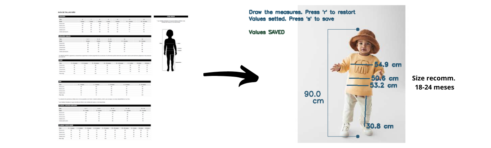
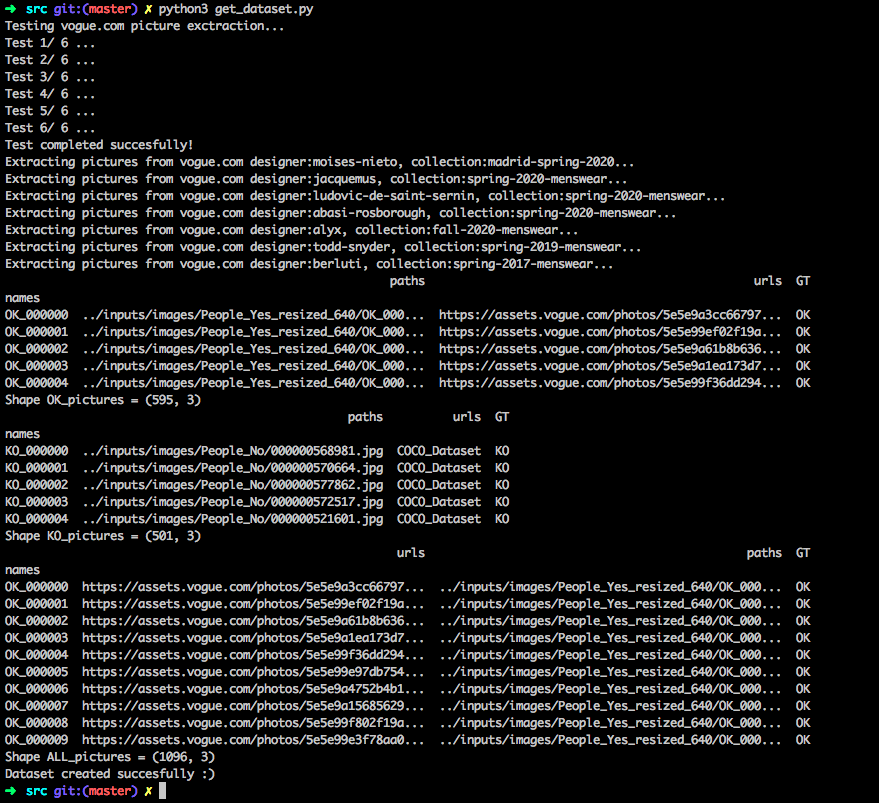
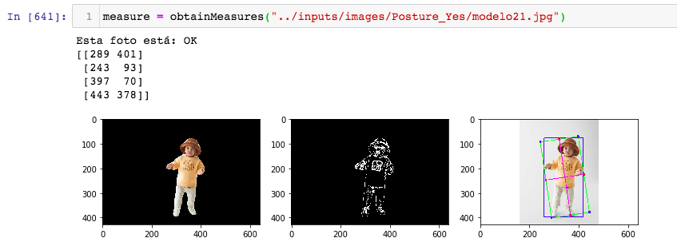
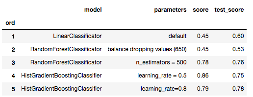
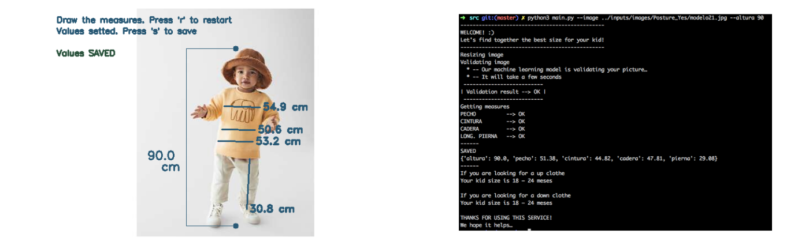

# Fit-size Recommender | Project

## Abstract
2 min video to show the process and outcome    

## Objective
The current size guide used in Zara Kids is a table not very user-friendly. The objective of this project is create a size recommendator using a picture of the user and a Machine Learning model that validate the picture and recommend the best size according to the main measures.

## Resources and libraries
- Sklearn | Machine Learning Library with regression models
- CV2 | Image treatment for python
- Tkinter | GUI for python

## Inputs
- train_human_dataset_images | Shape 565
- train_not_human_dataset_images | Shape 590
- test_kids_dataset_images | Shape 50
- Updated size recommendation dataset

## Outputs
- Models trained
- Code to recommend size

## Methodology
1. Generate the strategy

2. Cleaning and create all datasets
Using webscrapping the picture dataset is generated.

In the cleaning work, the following decision has to be done 
- Ensure not Null values
- Avoid not numeric values
- Drop the high correlated features
- Standardize or normalize high-value range features
- Get all images path

3. Identify the best model
Different models apport different results. Some of them are analysed in the project.
- LinearClassification
- RandomForestClassification
- HistGradientBoostingClassification

4. Analyse the result
There are metrics from sklearn that help you to choose the best model
- Accuracy score
- MRSE…

5. Generate the cv2 image treatment
- Get measures in the picture
- Ensure pixel per metric transformation
- Save this measures

6. Recommend using query to the size dataset
- Obtain the size for the measures given

## Results

As it can be appreciated, the best recommendation for the given measures is addresed.

## Contributing
Pull requests are welcome. For major changes, please open an issue first to discuss what you would like to change.

## Project status
Learning and enjoying every day.
Next steps:
- Product matrix and % of recommendation based on delivery and satisfaction for simmilar users 
- Try better neural networks to improve the effficiency and velocity of the model
- Work on the automathic recognision pattern
- HTML, CSS, JS

